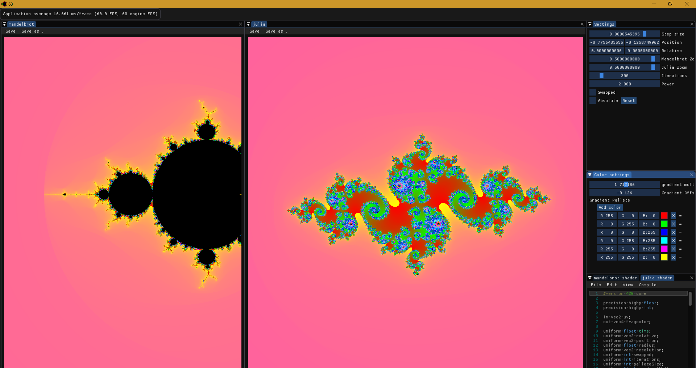
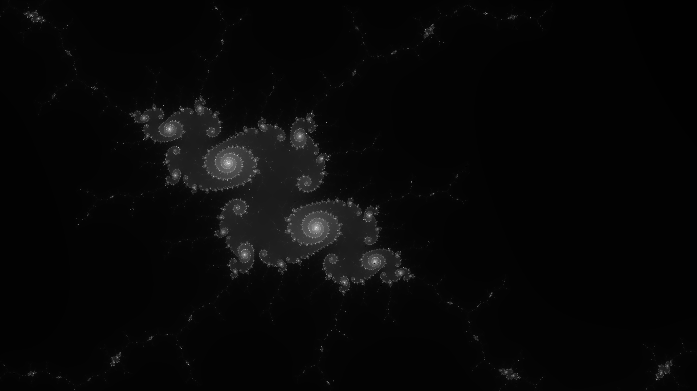
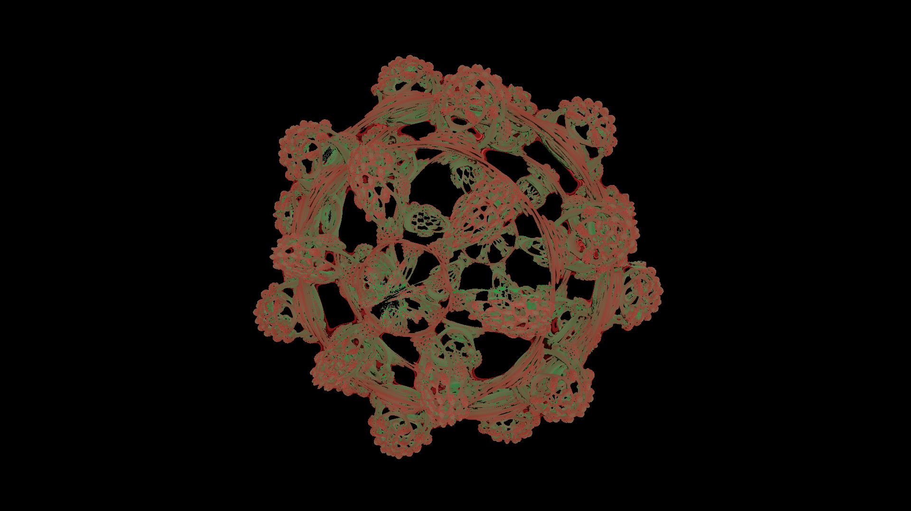

# Mandelbrot Generator
This is just a toy I made to entertain myself while in boring meetings.

### Dependancies
* [GLAD for opengl loading](https://glad.dav1d.de/)
* [window and framebuffer wrangling](https://www.glfw.org/)
* [fun math stuff](https://glm.g-truc.net/0.9.9/index.html)
* [the entire GUI](https://github.com/ocornut/imgui)
* [Text editor](https://github.com/BalazsJako/ImGuiColorTextEdit)
* [image saving and loading](https://github.com/nothings/stb)

# Sample Images

# Future plans
I've been playing with ray marching. So far I have a lot of ideas on where this will go. I dont know when I'll get to work on it, but some big changes need to happen before getting there.

For now heres a teaser:

